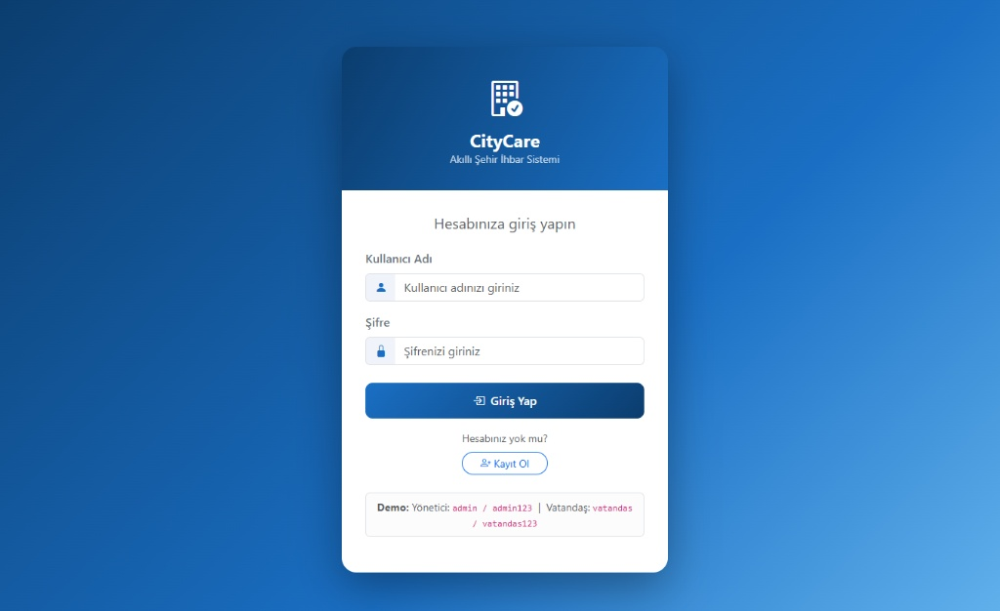
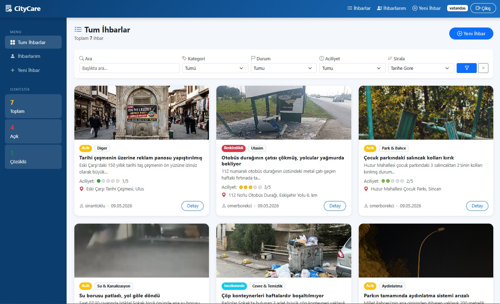
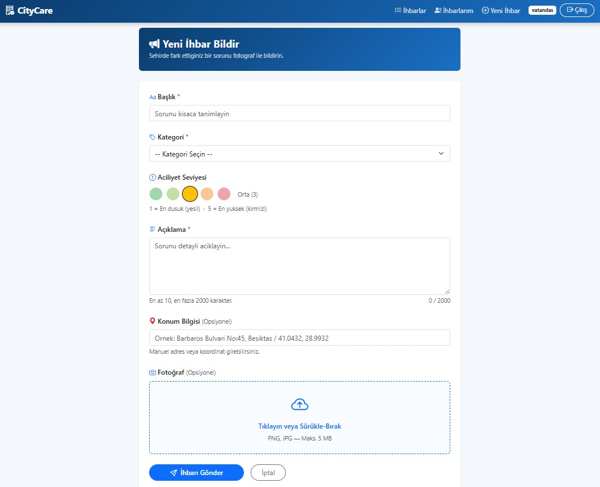
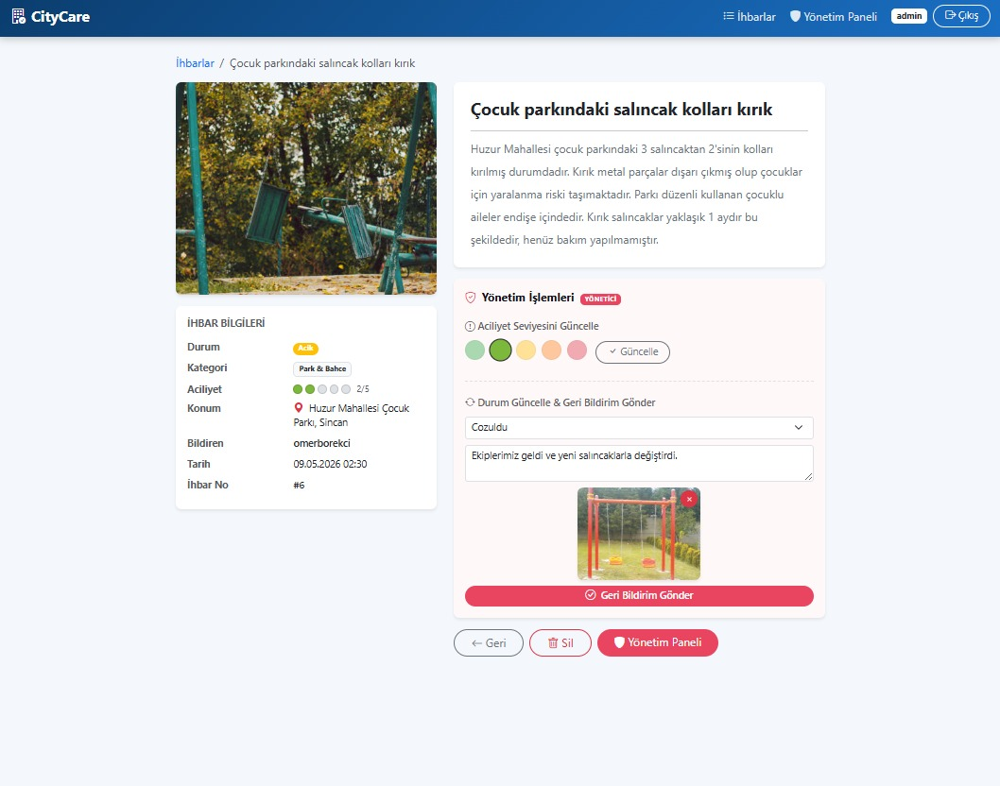
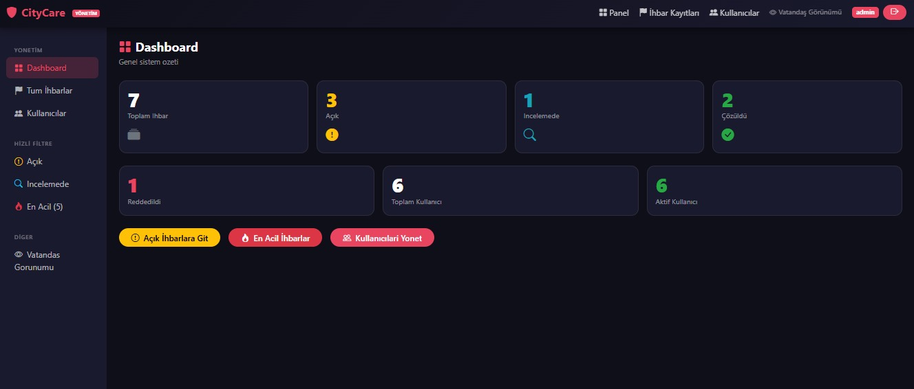
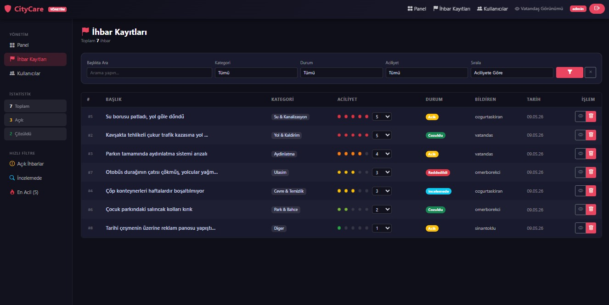
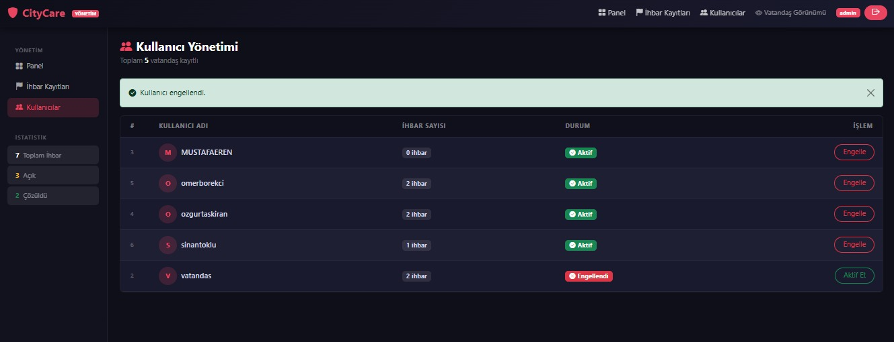

<div align="center">
  <h1>🏙️ CityCare</h1>
  <p><strong>Akıllı Şehir İhbar ve Kent Yönetim Sistemi</strong></p>
  <p>
    
    
    
    
    
  </p>
  <p>Vatandaşların şehirdeki sorunları fotoğraflı bildirebildiği, yetkililerin bu ihbarları yönettiği tam fonksiyonel web platformu.</p>
</div>

---

## 📸 Ekran Görüntüleri

<table>
  <tr>
    <td align="center"><b>🔐 Giriş Sayfası</b></td>
    <td align="center"><b>🏙️ İhbar Listesi</b></td>
  </tr>
  <tr>
    <td></td>
    <td></td>
  </tr>
  <tr>
    <td align="center"><b>📝 Yeni İhbar Oluştur</b></td>
    <td align="center"><b>🔍 İhbar Detayı</b></td>
  </tr>
  <tr>
    <td></td>
    <td></td>
  </tr>
  <tr>
    <td align="center"><b>🛡️ Admin Panosu</b></td>
    <td align="center"><b>📋 Admin İhbar Yönetimi</b></td>
  </tr>
  <tr>
    <td></td>
    <td></td>
  </tr>
  <tr>
    <td align="center" colspan="2"><b>👥 Kullanıcı Yönetimi</b></td>
  </tr>
  <tr>
    <td colspan="2" align="center"></td>
  </tr>
</table>

---

## ✨ Özellikler

| Özellik | Açıklama |
|---|---|
| 🔐 Spring Security | Giriş/Çıkış, CSRF koruması, rol tabanlı URL erişim kontrolü |
| 🖼️ BLOB Resim Depolama | Resimler MySQL LONGBLOB olarak saklanır |
| 🔍 Dinamik Arama | Başlık, kategori, durum ve aciliyet filtresi; JPQL ile |
| 📄 Sayfalama | Spring Data Page ile 9'lu/15'li sayfa gösterimi |
| ✅ CRUD | Oluştur, Listele, Detay, Düzenle, Sil |
| 💬 Admin Geri Bildirim | Durum güncelleme + opsiyonel açıklama + sürükle-bırak fotoğraf |
| 🚨 Aciliyet Sistemi | 1-5 puan arası renk kodlu balon göstergesi |
| 📍 Konum Bilgisi | Serbest metin adres veya koordinat girişi |
| 🚫 Kullanıcı Engelleme | Admin vatandaş hesaplarını pasif hale getirebilir |
| 🎨 Tema Ayrımı | Vatandaş (mavi) ve admin (koyu antrasit) farklı tema |

---

## 🚀 Kurulum

### Gereksinimler

| Araç | Sürüm |
|---|---|
| Java JDK | 17+ |
| Maven | 3.8+ |
| MySQL | 8.0+ |

### 1. Veritabanı Oluştur

```sql
CREATE DATABASE citycare_db CHARACTER SET utf8mb4 COLLATE utf8mb4_turkish_ci;
```

### 2. application.properties Ayarla

```properties
spring.datasource.url=jdbc:mysql://localhost:3306/citycare_db?useSSL=false&serverTimezone=Europe/Istanbul&characterEncoding=UTF-8&allowPublicKeyRetrieval=true
spring.datasource.username=root
spring.datasource.password=SIFRENIZ
spring.datasource.driver-class-name=com.mysql.cj.jdbc.Driver
spring.jpa.properties.hibernate.dialect=org.hibernate.dialect.MySQLDialect
```

### 3. Çalıştır

```bash
mvn spring-boot:run
```

### 4. Tarayıcıda Aç

```
http://localhost:8080
```

---

## 🔑 Varsayılan Hesaplar

| Rol | Kullanıcı Adı | Şifre |
|---|---|---|
| Admin | `admin` | `admin123` |
| Vatandaş | `vatandas` | `vatandas123` |

> ⚠️ Production ortamında bu şifreleri değiştirin!

---

## 🗂️ Proje Yapısı

```
src/main/java/com/citycare/
├── config/
│   ├── SecurityConfig.java           # Spring Security yapılandırması
│   └── DataInitializer.java          # Başlangıçta demo hesapları oluşturur
├── controller/
│   ├── AuthController.java           # Giriş / Kayıt sayfaları
│   ├── ReportController.java         # CRUD + arama endpointleri
│   ├── AdminController.java          # Admin ihbar + kullanıcı yönetimi
│   └── ImageController.java          # BLOB → HTTP görüntü sunucu
├── dto/
│   ├── ReportDTO.java                # İhbar form nesnesi
│   └── StatusUpdateDTO.java          # Admin geri bildirim formu
├── entity/
│   ├── User.java                     # Kullanıcı varlığı
│   ├── Report.java                   # İhbar varlığı (LONGBLOB + admin geri bildirim)
│   ├── Role.java                     # USER / ADMIN
│   ├── ReportCategory.java           # Yol, Park, Çevre vb.
│   └── ReportStatus.java             # Açık, İncelemede, Çözüldü, Reddedildi
├── repository/
│   ├── UserRepository.java
│   └── ReportRepository.java         # Dinamik JPQL arama sorguları
├── service/
│   ├── UserService.java
│   ├── UserDetailsServiceImpl.java   # Spring Security entegrasyonu
│   └── ReportService.java
└── util/
    └── ImageUtil.java
```

---

## 🔒 Güvenlik Akışı

```
İstek gelir
    │
    ▼
SecurityFilterChain
    ├── /login, /register, /images/** ──► Herkese açık
    ├── /admin/**              ──────────► Yalnızca ROLE_ADMIN
    └── Diğer tüm yollar ─────────────► Kimlik doğrulanmış kullanıcı
                                               │
                              UserDetailsServiceImpl ─► BCrypt doğrulama
                                               │
                                  ┌────────────┴────────────┐
                               Başarılı                 Başarısız
                                  │                         │
                              /reports              /login?error=true
```

---

## 🛠️ Teknolojiler

| Katman | Teknoloji |
|---|---|
| Backend | Spring Boot 3.2.5, Spring Security, Spring Data JPA |
| Frontend | Thymeleaf, Bootstrap 5.3, Bootstrap Icons |
| Veritabanı | MySQL 8.0 (LONGBLOB görüntü depolama) |
| Güvenlik | BCrypt (strength 12), CSRF koruması |
| Build | Apache Maven |
